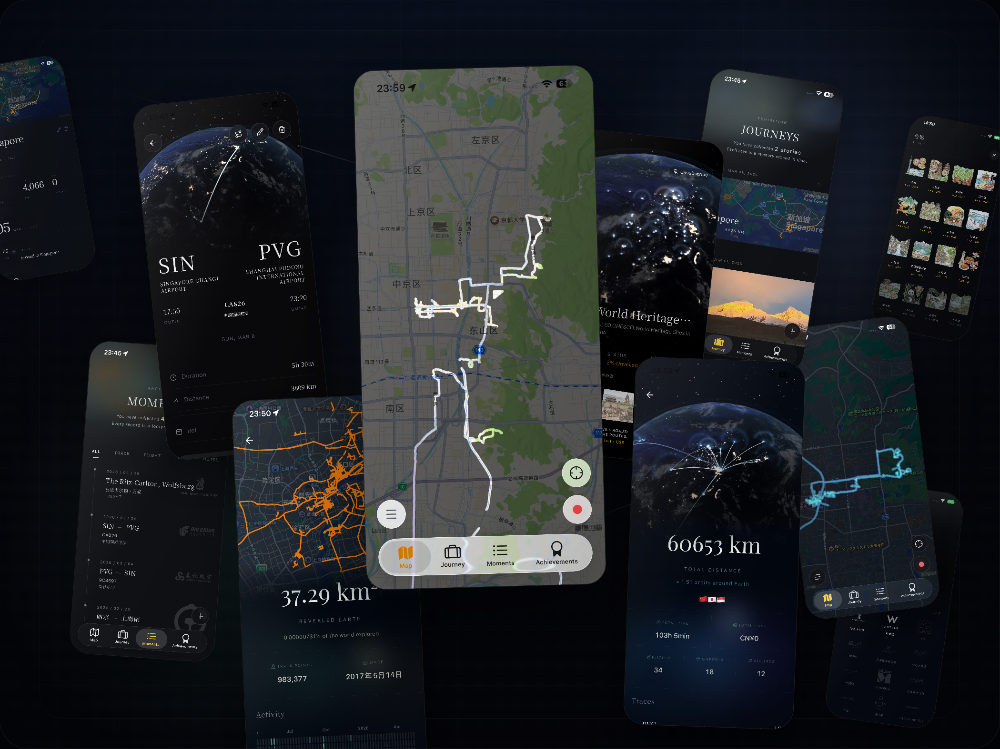

<p align="center">
  <a href="./README.md">English</a> | <a href="./README.zh-CN.md">简体中文</a>
</p>

<p align="center">
  <a href="https://apps.apple.com/app/apple-store/id6758825434?pt=128525175&ct=github&mt=8">
    
  </a>
  <a href="https://play.google.com/store/apps/details?id=xyz.zinglix.sillage">
    
  </a>
  <a href="https://github.com/ZingLix/Sillage/releases">
    
  </a>
</p>

<p align="center">
  
</p>

<h1 align="center">Sillage</h1>

<p align="center">把去过的世界，慢慢点亮。</p>



Sillage 是一款把轨迹、火车、飞机、酒店放在一起记录的旅行 App。  


你还可以按时间轴回放自己的探索过程，看走过的路线怎样一点点铺开，地图上的探索面积又是如何慢慢增长的。

所有数据默认保存在本地，不会被上传到平台，也不会被拿去做别的用途。  
如果你需要备份或同步，Sillage 也只会把数据传到你自己指定的网盘或远程存储。

## 你可以用它做什么

### 地图与轨迹

- 用迷雾地图慢慢点亮你真正走过的世界
- 记录路线、轨迹和移动过程
- 按时间轴回放探索范围如何一点点增长

### 旅程与记录

- 记录火车、飞机、酒店和轨迹等不同类型的旅行信息
- 可以从你常用的旅行服务和软件里自动导入已有数据
- 用旅程把照片、飞机、火车、轨迹和酒店重新串联成一次完整出行

### 照片与回忆

- 把旅行照片重新放回当时的旅程里
- 结合时间和地点整理更完整的回忆
- 让照片不再只是停在系统相册里

### 成就与收藏

- 收集丰富的自定义旅行成就
- 不只有限于行政区划，还可以探索世界遗产、文明 6 奇观等趣味主题
- 让旅行记录更像一本可以慢慢积累的纪念册

### 数据与归属

- 所有记录默认保存在本地设备
- 不会上传到平台，没有额外的隐私负担
- 可直接上传至你的 OneDrive、WebDAV、iCloud 做备份或同步

## Agent Skill

这个仓库包含 `sillage-mcp` agent skill，可以让支持 skills 的 Agent 通过 Sillage App 的本地 MCP Server 管理你的旅行记录。

```bash
npx skills add ZingLix/Sillage
```

## 为什么是 Sillage

很多旅行记录工具擅长管理信息，  
但 Sillage 更想帮你留住旅行的形状。

它不是把旅途拆成冷冰冰的条目，  
而是试着把路线、地点、停留、照片和时间重新缝合起来，  
让一段旅行重新变得可以被回想、被翻阅、被珍藏。

## 这个仓库

这里会作为 Sillage 的公开主页，也会用来收集：

- 使用中的问题反馈
- 新功能想法
- 对体验和设计的建议
- 你希望 Sillage 以后变成什么样子
